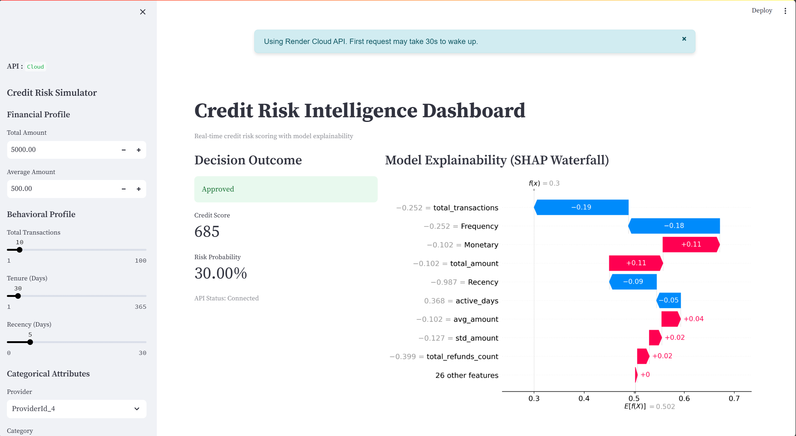

# BNPL Credit Scoring Engine: Alternative Data Implementation
[](https://github.com/nathanaeldereje/credit-risk-model/actions/workflows/ci.yml)
[](https://github.com/nathanaeldereje/credit-risk-model)
[](https://credit-risk-model-uuz3.onrender.com)

A production-ready credit scoring system built for Bati Bank to facilitate Buy-Now-Pay-Later (BNPL) services using alternative eCommerce behavioral data. 
## 🖥️ Dashboard Preview

> **Interactive Decision Support:** The dashboard allows loan officers to simulate applicant profiles and receive real-time credit scores accompanied by SHAP "Reason Codes."

## 🏦 Business Problem
Traditional credit scoring relies on formal history (Credit Bureaus), which excludes millions of potential customers in emerging markets. Bati Bank needs a way to:
1.  **Quantify Risk** without traditional credit scores.
2.  **Minimize Default** while maximizing financial inclusion.
3.  **Ensure Transparency** to comply with Basel II capital accords and regulatory audit requirements.

## 🛠 Solution Overview
This project implements a multi-stage machine learning pipeline that transforms raw behavioral transactions into actionable credit intelligence:
*   **Behavioral Proxy Labeling:** Uses K-Means clustering on RFM (Recency, Frequency, Monetary) metrics to define high-risk segments.
*   **Predictive Modeling:** A tuned Random Forest classifier that estimates default probability.
*   **Transparent Decisioning:** Integrated SHAP explainability providing "Reason Codes" for every loan decision.
*   **Deployment:** A microservice architecture with a FastAPI backend and an interactive Streamlit dashboard.

## 📈 Key Results
*   **96.65% Precision:** Achieved a **+2.03% improvement** in high-risk detection through modular feature engineering (Account Tenure/Active Days).
*   **0.9986 ROC-AUC:** Exceptional discriminatory power between low-risk and high-risk applicants.
*   **100% Transparency:** Every prediction includes a SHAP Waterfall plot, reducing "Model Risk" and satisfying regulatory "Right to Explanation."
*   **90% Test Coverage:** High-integrity codebase verified by 17 unit and integration tests.

## 🚀 Quick Start

```bash
# 1. Clone & Enter
git clone https://github.com/nathanaeldereje/credit-risk-model.git
cd credit-risk-model

# 2. Install Dependencies
pip install -r requirements.txt

# 3. Run the End-to-End Pipeline
python -m scripts.run_preprocessing  # Feature & Target Engineering
python -m scripts.run_training       # MLflow-tracked Training
python -m scripts.run_explainability # SHAP Report Generation
uvicorn src.api.main:app --reload   # Start the Backend API
# 4. Launch UI (Requires API running)
streamlit run src/dashboard/app.py
```

## 🏗 System Architecture
The system is built as a modular microservices architecture, ensuring that data processing, model training, and serving are decoupled and scalable.



## 📂 Project Structure
```text
credit-risk-model/
├── .github/workflows/ci.yml   # GitHub Actions (Linting, Testing, Coverage)
├── assets/                    # Professional visuals (Diagrams, Screenshots)
├── data/                      # Raw & Processed data (Git-ignored)
├── reports/figures/           # SHAP Global & Local explanation plots
├── scripts/                   # CLI Entry points for the modular pipeline
├── src/                       
│   ├── credit_risk/           # Core Logic Package (Engine & Processing)
│   ├── api/                   # Backend: FastAPI microservice
│   └── dashboard/             # Frontend: Streamlit Decision UI
├── tests/                     # 17+ Unit & Integration Tests (85% Coverage)
├── Dockerfile                 # Secure non-root container configuration
└── docker-compose.yml         # Full-stack local orchestration
```

## 🔗 Live Demo
Access the interactive Credit Decision Support System here:
[**Bati Bank Risk Dashboard**](https://credit-risk-model-3zqyyrjpsbg66xzfpgf8nv.streamlit.app/)    
*Note: The API is hosted on Render (Free Tier) and may take 30 seconds to wake up on the first request.*

## 🔬 Technical Details
*   **Data:** 95k+ transactions from the Xente eCommerce platform (Uganda). Preprocessing includes log-transformation of skewed monetary features and One-Hot Encoding for categorical pricing strategies.
*   **Model:** **Random Forest Classifier** optimized via GridSearchCV. 
    *   *Hyperparameters:* `n_estimators=50`, `max_depth=None`, `class_weight='balanced'`.
*   **Explainability:** **SHAP TreeExplainer** used to isolate the contribution of features like `Monetary` volume and `Recency` for individual risk profiles.
*   **Infrastructure:** Containerized with Docker, deployed using a hybrid cloud strategy (Render + Streamlit Cloud), and monitored via MLflow.

## 🔮 Future Improvements
*   **Automated Retraining:** Implement a CI/CD trigger to retrain the model if data drift is detected in production.
*   **Deep Learning:** Experiment with Tabular Transformers to capture non-linear temporal patterns.
*   **Alternative Data Expansion:** Integrate geolocation and device-type data to further refine the "Cold Start" risk score.
*   **API Versioning:** Implement `/v2/` endpoints to support iterative model upgrades without breaking the existing dashboard.

## 👨‍💻 Author
**Nathanael Dereje**  
*Analytics Engineer*  
[LinkedIn Profile](https://www.linkedin.com/in/nathanaeldereje/) | [GitHub](https://github.com/nathanaeldereje)
